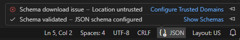
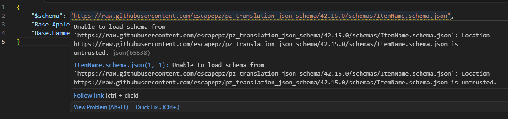

# Troubleshooting: Schema Download & Trusted Domains

When using JSON schemas from external URLs in VS Code, you may encounter a warning or failure to load the schema if the domain is not in your trusted list. This is common when using the `raw.githubusercontent.com` URLs recommended in this project.

## Identifying the Issue

If VS Code is unable to download the schema, you will see a warning in the status bar or when hovering over your JSON structure. It often looks like a "Schema download failed" or a prompt asking for permission.



## How to Configure Trusted Domains

To allow VS Code to safely download the Project Zomboid translation schemas, you need to add the GitHub content domain to your trusted settings.

1.  Open your VS Code Settings (**Ctrl + ,**).
2.  Search for `json.schemaDownload.trustedDomains`.
3.  Click **Add Item**.
4.  Enter `https://raw.githubusercontent.com/escapepz/pz_translation_json_schema`.



### Manual Settings edit

Alternatively, you can add this directly to your `.vscode/settings.json` file:

```json
{
    "json.schemaDownload.trustedDomains": [
        "https://raw.githubusercontent.com/escapepz/pz_translation_json_schema"
    ]
}
```

Once added, VS Code will be able to fetch the latest schema definitions directly from this repository, enabling full auto-completion and validation for your translation files.
